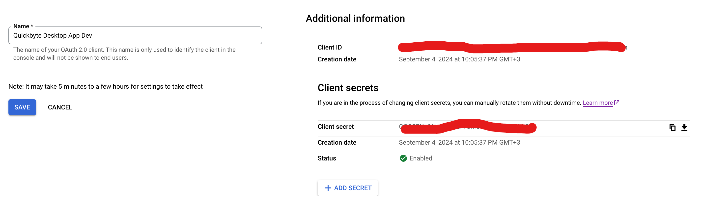

# Quickbyte Transfer Desktop App

Built with [Tauri](https://tauri.dev) and Vue 3.

# Vue 3 + TypeScript + Vite

This template should help get you started developing with Vue 3 and TypeScript in Vite. The template uses Vue 3 `<script setup>` SFCs, check out the [script setup docs](https://v3.vuejs.org/api/sfc-script-setup.html#sfc-script-setup) to learn more.

Learn more about the recommended Project Setup and IDE Support in the [Vue Docs TypeScript Guide](https://vuejs.org/guide/typescript/overview.html#project-setup).

## Recommended IDE Setup

- [VS Code](https://code.visualstudio.com/) + [Volar](https://marketplace.visualstudio.com/items?itemName=Vue.volar) + [Tauri](https://marketplace.visualstudio.com/items?itemName=tauri-apps.tauri-vscode) + [rust-analyzer](https://marketplace.visualstudio.com/items?itemName=rust-lang.rust-analyzer)

## Type Support For `.vue` Imports in TS

Since TypeScript cannot handle type information for `.vue` imports, they are shimmed to be a generic Vue component type by default. In most cases this is fine if you don't really care about component prop types outside of templates. However, if you wish to get actual prop types in `.vue` imports (for example to get props validation when using manual `h(...)` calls), you can enable Volar's Take Over mode by following these steps:

1. Run `Extensions: Show Built-in Extensions` from VS Code's command palette, look for `TypeScript and JavaScript Language Features`, then right click and select `Disable (Workspace)`. By default, Take Over mode will enable itself if the default TypeScript extension is disabled.
2. Reload the VS Code window by running `Developer: Reload Window` from the command palette.

You can learn more about Take Over mode [here](https://github.com/johnsoncodehk/volar/discussions/471).

## Use Diesel CLI for migrations and ORM operations

The app uses Diesel ORM to interact with the SQLite database for data persistence (e.g. being able to resume incomplete transfers).

Check out [the getting started guide](https://diesel.rs/guides/getting-started). The guide uses Postgres, but they have [SQLite examples](https://github.com/diesel-rs/diesel/tree/2.2.x/examples/sqlite) in their repo.

```
cargo install diesel_cli
```

To create and run migrations during development, the `diesel` CLI requires a development database. Since we don't bundle the db with the app, I'd recommend creating a temporary db file at `src-tauri/test.db` for use with `diesel` migration commands:

```
cd src-tauri
```

Generate new migration:

```
diesel migration generate create_transfers --database-url testdb
```

Run migrations:

```
diesel migration run --database-url testdb
```

## Local config and setup

Before you can run the app, you should sure the environment variables defined in `env.example` are set.

To support the "Sign in with Google" feature, the following env vars are required:

- `GOOGLE_CLIENT_ID`
- `GOOGLE_CLIENT_SECRET`

You need to create OAuth 2.0 Client Credentials in the Google developers console at https://console.cloud.google.com/apis/credentials. You can find instructions here: https://developers.google.com/identity/protocols/oauth2/native-app:

Any application that uses OAuth 2.0 to access Google APIs must have authorization credentials that identify the application to Google's OAuth 2.0 server. The following steps explain how to create credentials for your project. Your applications can then use the credentials to access APIs that you have enabled for that project.

- Go to the [Credentials page](https://console.cloud.google.com/apis/credentials).
- Click **Create credentials** > **OAuth client ID.**
- The following sections describe the client types that Google's authorization server supports.
- Choose the **Desktop** client type that is recommended for your application, name your OAuth client, and set the other fields in the form as appropriate.

.

Note that this should use different Google auth credentials from the web app.

For the server to successfully handle Google tokens from this app, you should also register the same Google client ID at the server using the env variable `GOOGLE_CLIENT_ID_DESKTOP_TRANSFER_APP`.

The `SERVER_BASE_URL` should be the base URL of the Quickbyte backend server the app will call. This makes it easier to target `http://localhost:3000` when testing against the local server, and `https://quickbyte-staging.up.railway.app` on staging and ultimately `https://api.quickbyte.io` on production without hardcording them in the app.

We have configured the values of these env variables to be compiled into the app binary at build time. This means that you (or the end user) will have to set these environment variables to run the compiled app.

**Important** Since the environment variables are compiled into the app, they can be reverse engineered by the end user. That means we should not store senstive data or secrets there. The `GOOGLE_CLIENT_SECRET` for Desktop apps and native apps in general is not considered secret (the Google documentation acknowledges this fact). If we need to deal with secret keys that should not be leaked to any end user, those should remain server-side.

## Dependencies

This app depends on `@quickbyte/common` for shared TypeScript types and utility functions and `@quickbyte/server` for the tRPC client definitions. Before you can run the app locally, you should make sure those are installed first:

Run the following from the repository's root (i.e `/quickbyte`), not the desktop app root (~`/quickbyte/desktop/gui`~)

```
npm install --workspaces
npm run build -w @quicbyte/common
npm run build -w @quickbyte/server
```

For the app to work, it should also be linked to a server. You can run the Quickbyte server (`@quickbyte/server`) locally. This is especially useful if you want to work offline or minimize network calls, or you want to make some changes to the server code as well. In this case you must make sure to the set `SERVER_BASE_URL` of the desktop app to the URL of the local server and you should create and configure Google auth client IDs.

If you don't need to update server code, you can point your local desktop app to the remote staging server by setting `SERVER_BASE_URL` to `https://quickbyte-staging.up.railway.app`. This can save the hassle of configuring or running the server locally. You should also set the `GOOGLE_CLIENT_ID` and `GOOGLE_CLIENT_SECRET` to those expected by the staging server. You can reach out to Clément for support in getting the keys.

## Running the app

Run the following command from the desktop source root (i.e. `quicbyte/desktop/gui`)

```
cargo tauri dev
```

## Building and configuration

tauri.conf.json - name, identifier, version

db_bath

key_ring

pre-build command to install server and common deps

## Release

We use GitHub Actions to automate the production build and release of the app. We support multiple types of builds:

- local builds on the dev machine, which you can build using `cargo tauri build`
- dev or review builds which use Github Actions CI. These are meant provde a way to build a production-like version of the app on demand for quality assurance, to allow other devs to test, to generate builds for different OSes and architectures, to test things like the updater, testing release notes, testing the installer etc. This can be generated at any time by pushing to the `desktop-transfer-dev-release` branch.
- staging builds, which are meant for testing and verifying the near-final release before it's shipped to users
- official production builds, which will be shipped to end users

To isolate and distinguish the different builds, we use different configuration options and release pipelines.
